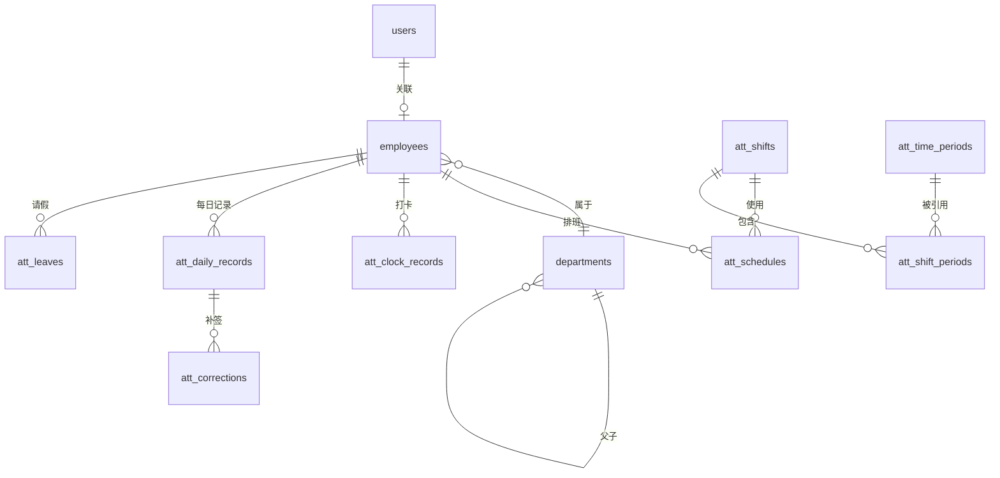

# 数据库设计

## 一、模块归属

| 模块 | 负责人 | 表 |
|------|--------|-----|
| 用户/组织 | sasuke | users, employees, departments |
| 考勤配置 | naruto | att_time_periods, att_shifts, att_shift_periods, att_schedules, att_settings |
| 考勤数据 | naruto | att_clock_records, att_daily_records, att_corrections, att_leaves |
| 统计报表 | sasuke | 基于 att_daily_records 查询，无独立表 |

---

## 二、ER 图



---

## 三、表结构设计

### 用户/组织模块（sasuke）

#### users - 用户账号表

| 字段 | 类型 | 必填 | 说明 |
|------|------|:----:|------|
| id | INT | ✓ | 主键，自增 |
| username | VARCHAR(50) | ✓ | 用户名，唯一 |
| password_hash | VARCHAR(255) | ✓ | 密码哈希 |
| employee_id | INT | | 关联人员ID，外键 |
| role | ENUM | ✓ | admin/user |
| status | ENUM | ✓ | active/inactive |
| created_at | DATETIME | ✓ | 创建时间 |
| updated_at | DATETIME | ✓ | 更新时间 |

#### employees - 人员档案表

| 字段 | 类型 | 必填 | 说明 |
|------|------|:----:|------|
| id | INT | ✓ | 主键，自增 |
| employee_no | VARCHAR(50) | ✓ | 人员编号，唯一 |
| name | VARCHAR(100) | ✓ | 姓名 |
| phone | VARCHAR(20) | | 手机号 |
| email | VARCHAR(100) | | 邮箱 |
| dept_id | INT | | 部门ID，外键 |
| status | ENUM | ✓ | active(在职)/inactive(离职) |
| hire_date | DATE | | 入职日期 |
| leave_date | DATE | | 离职日期 |
| created_at | DATETIME | ✓ | 创建时间 |
| updated_at | DATETIME | ✓ | 更新时间 |

#### departments - 部门表

| 字段 | 类型 | 必填 | 说明 |
|------|------|:----:|------|
| id | INT | ✓ | 主键，自增 |
| name | VARCHAR(100) | ✓ | 部门名称 |
| parent_id | INT | | 父部门ID，自引用 |
| sort_order | INT | ✓ | 排序，默认0 |
| created_at | DATETIME | ✓ | 创建时间 |
| updated_at | DATETIME | ✓ | 更新时间 |

---

### 考勤配置模块（naruto）

#### att_time_periods - 时间段表

| 字段 | 类型 | 必填 | 说明 |
|------|------|:----:|------|
| id | INT | ✓ | 主键，自增 |
| name | VARCHAR(100) | ✓ | 时间段名称 |
| type | ENUM | ✓ | normal(普通)/flexible(弹性) |
| work_start | TIME | | 上班时间（普通类型必填） |
| work_end | TIME | | 下班时间（普通类型必填） |
| check_in_start | TIME | | 签到开始时间 |
| check_in_end | TIME | | 签到结束时间 |
| check_out_start | TIME | | 签退开始时间 |
| check_out_end | TIME | | 签退结束时间 |
| require_check_in | BOOLEAN | ✓ | 是否必须签到，默认true |
| require_check_out | BOOLEAN | ✓ | 是否必须签退，默认true |
| late_rule | JSON | | 迟到规则 |
| early_leave_rule | JSON | | 早退规则 |
| absent_check_in_rule | JSON | | 未签到规则 |
| absent_check_out_rule | JSON | | 未签退规则 |
| flex_calc_method | ENUM | | first_last(首尾)/pair(两两) |
| flex_min_interval | INT | | 有效打卡间隔（分钟） |
| flex_daily_hours | DECIMAL(4,2) | | 每日工作时长（小时） |
| flex_day_switch | TIME | | 跨天切换点 |
| created_at | DATETIME | ✓ | 创建时间 |
| updated_at | DATETIME | ✓ | 更新时间 |

#### att_shifts - 班次表

| 字段 | 类型 | 必填 | 说明 |
|------|------|:----:|------|
| id | INT | ✓ | 主键，自增 |
| name | VARCHAR(100) | ✓ | 班次名称 |
| cycle_days | INT | ✓ | 周期天数，默认7 |
| created_at | DATETIME | ✓ | 创建时间 |
| updated_at | DATETIME | ✓ | 更新时间 |

#### att_shift_periods - 班次时间段关联表

| 字段 | 类型 | 必填 | 说明 |
|------|------|:----:|------|
| id | INT | ✓ | 主键，自增 |
| shift_id | INT | ✓ | 班次ID，外键 |
| period_id | INT | ✓ | 时间段ID，外键 |
| day_of_cycle | INT | ✓ | 周期内第几天（1-7） |
| sort_order | INT | ✓ | 排序，默认0 |

#### att_schedules - 排班表

| 字段 | 类型 | 必填 | 说明 |
|------|------|:----:|------|
| id | INT | ✓ | 主键，自增 |
| employee_id | INT | ✓ | 人员ID，外键 |
| shift_id | INT | ✓ | 班次ID，外键 |
| start_date | DATE | ✓ | 生效开始日期 |
| end_date | DATE | ✓ | 生效结束日期 |
| created_at | DATETIME | ✓ | 创建时间 |
| updated_at | DATETIME | ✓ | 更新时间 |

#### att_settings - 考勤设置表

| 字段 | 类型 | 必填 | 说明 |
|------|------|:----:|------|
| id | INT | ✓ | 主键，自增 |
| key | VARCHAR(50) | ✓ | 设置键，唯一 |
| value | JSON | ✓ | 设置值 |
| description | VARCHAR(200) | | 说明 |
| updated_at | DATETIME | ✓ | 更新时间 |

**默认设置：**
- `day_switch_time`: "05:00" （考勤日切换时间）
- `data_retention_years`: 2 （数据保留年限）

---

### 考勤数据模块（naruto）

#### att_clock_records - 原始打卡记录表

| 字段 | 类型 | 必填 | 说明 |
|------|------|:----:|------|
| id | BIGINT | ✓ | 主键，自增 |
| employee_id | INT | ✓ | 人员ID，外键 |
| clock_time | DATETIME | ✓ | 打卡时间 |
| clock_type | ENUM | ✓ | app(APP打卡)/web(Web手动打卡) |
| operator_id | INT | | 操作人ID（Web打卡时记录） |
| remark | VARCHAR(200) | | 备注 |
| created_at | DATETIME | ✓ | 创建时间 |

#### att_daily_records - 每日考勤记录表

| 字段 | 类型 | 必填 | 说明 |
|------|------|:----:|------|
| id | BIGINT | ✓ | 主键，自增 |
| employee_id | INT | ✓ | 人员ID，外键 |
| work_date | DATE | ✓ | 工作日 |
| shift_id | INT | | 班次ID，外键 |
| period_id | INT | | 时间段ID，外键 |
| check_in_time | DATETIME | | 签到时间 |
| check_out_time | DATETIME | | 签退时间 |
| status | ENUM | ✓ | 考勤状态 |
| actual_minutes | INT | | 实际出勤分钟 |
| effective_minutes | INT | | 有效出勤分钟 |
| late_minutes | INT | | 迟到分钟数 |
| early_leave_minutes | INT | | 早退分钟数 |
| absent_minutes | INT | | 缺勤分钟数 |
| remark | VARCHAR(500) | | 备注 |
| created_at | DATETIME | ✓ | 创建时间 |
| updated_at | DATETIME | ✓ | 更新时间 |

**status 枚举值：**
- normal: 正常
- late: 迟到
- early_leave: 早退
- absent: 缺勤
- leave: 请假
- business_trip: 出差

#### att_corrections - 补签记录表

| 字段 | 类型 | 必填 | 说明 |
|------|------|:----:|------|
| id | INT | ✓ | 主键，自增 |
| employee_id | INT | ✓ | 人员ID，外键 |
| daily_record_id | BIGINT | ✓ | 每日记录ID，外键 |
| type | ENUM | ✓ | check_in(补签到)/check_out(补签退) |
| correction_time | DATETIME | ✓ | 补签时间 |
| operator_id | INT | ✓ | 操作人ID，外键 |
| remark | VARCHAR(200) | | 备注 |
| created_at | DATETIME | ✓ | 操作时间 |

#### att_leaves - 请假/出差记录表

| 字段 | 类型 | 必填 | 说明 |
|------|------|:----:|------|
| id | INT | ✓ | 主键，自增 |
| employee_id | INT | ✓ | 人员ID，外键 |
| type | ENUM | ✓ | 请假类型 |
| start_time | DATETIME | ✓ | 开始时间 |
| end_time | DATETIME | ✓ | 结束时间 |
| reason | VARCHAR(500) | | 原因/备注 |
| status | ENUM | ✓ | 审批状态 |
| approver_id | INT | | 审批人ID |
| approved_at | DATETIME | | 审批时间 |
| created_at | DATETIME | ✓ | 申请时间 |
| updated_at | DATETIME | ✓ | 更新时间 |

**type 枚举值：**
- annual: 年假
- sick: 病假
- personal: 事假
- business_trip: 出差
- maternity: 产假
- paternity: 陪产假
- marriage: 婚假
- bereavement: 丧假
- other: 其他

**status 枚举值：**
- pending: 待审批
- approved: 已通过
- rejected: 已拒绝
- cancelled: 已撤销

---

## 四、索引设计

```sql
-- 人员按部门查询
CREATE INDEX idx_employee_dept ON employees(dept_id);

-- 人员按编号查询
CREATE UNIQUE INDEX idx_employee_no ON employees(employee_no);

-- 打卡记录按人员+时间查询
CREATE INDEX idx_clock_employee_time ON att_clock_records(employee_id, clock_time);

-- 每日记录按人员+日期查询
CREATE INDEX idx_daily_employee_date ON att_daily_records(employee_id, work_date);

-- 排班按人员+日期范围查询
CREATE INDEX idx_schedule_employee_date ON att_schedules(employee_id, start_date, end_date);

-- 请假按人员+时间查询
CREATE INDEX idx_leave_employee_time ON att_leaves(employee_id, start_time, end_time);
```

---

## 五、数据保留策略

| 表 | 保留期限 | 清理策略 |
|------|----------|----------|
| att_clock_records | 2年 | 定时任务归档/删除 |
| att_daily_records | 2年 | 定时任务归档/删除 |
| 其他 | 永久 | - |
