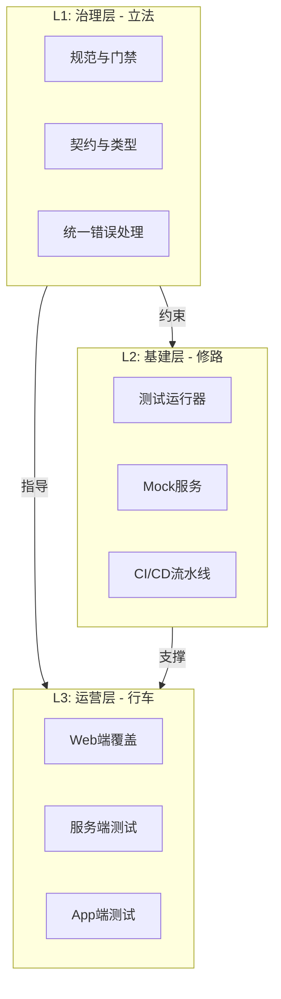

# ENG01: 工程效能与质量体系 (Engineering Efficiency & Quality System)

> **One System, Total Quality.**

本体系融合了原 **ENG01 (治理)**、**test_sys (基建)** 和 **QA-WEB (落地)** 三大模块，构建了从规范制定到基础设施，再到业务落地的完整工程闭环。

## 🏛️ 体系架构

我们采用 **G-I-O 三层架构**：

## 📚 模块导航

### 0. Overview
- **总需求文档**: [Requirements (Unified)](./requirements.md)
- **体系融合说明**: [Alignment Document](./ALIGNMENT_ENG01.md)

### 1. Governance (治理层)
*立法与规范，定义"什么是好的代码"*

- **L1 详细需求**: [Governance Requirements](./governance/requirements.md)
- **分支策略**: [Branch Protection](./governance/branch-protection.md)
- **数据校验**: [Zod Usage Guide](./governance/zod-usage.md)
- **设计文档**: [System Design](./governance/design.md)

### 2. Infrastructure (基建层)
*工具与平台，提供"如何测试的能力"*

> 原 `test_sys` 模块已并入此处。

- **测试指南**: [Test System Guide](./infrastructure/guide.md)
- **测试需求**: [Infrastructure Requirements](./infrastructure/requirements.md)
- **任务清单**: [Infrastructure Tasks](./infrastructure/tasks.md)

### 3. Operations (运营层)
*落地与执行，解决"具体的质量问题"*

> 包含各端具体的质量提升专项行动。

- **Web端覆盖 (S1)**: [Web QA Iteration 1](./operations/web-coverage-s1/requirements.md)
  - [设计文档](./operations/web-coverage-s1/design.md)
  - [验收标准](./operations/web-coverage-s1/acceptance.md)

## 🔄 工作流映射

| 阶段 | 涉及模块 | 关键动作 |
|------|----------|----------|
| **开发前** | Governance | 阅读 Lint 规则，定义 Zod Schema |
| **开发中** | Infrastructure | 运行 `pnpm test`，使用 MSW Mock |
| **提交前** | Governance | 触发 Husky (Lint-staged) |
| **合并后** | Infrastructure | 触发 GitHub Actions CI |
| **专项治理** | Operations | 执行如 "QA-WEB-01" 的覆盖率提升任务 |
