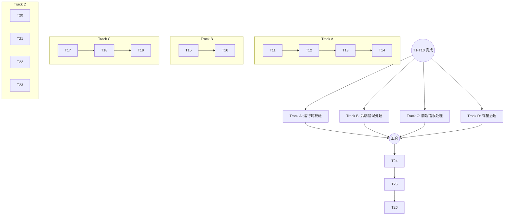

# ENG01 - 任务拆分

## 任务列表

### 阶段一：基础设施建设

| ID | 任务 | 负责人 | 状态 | 预估 |
|----|------|--------|------|------|
| T1 | 统计存量问题基线（any: 144处, console.log: 62处） | AI | ✅ | 0.5h |
| T2 | 配置 monorepo 根级 ESLint（规则设为 warn） | AI | ✅ | 1h |
| T3 | 配置 server 端 ESLint 继承 | AI | ✅ | 0.5h |
| T4 | 配置 web 端 ESLint 继承 | AI | ✅ | 0.5h |
| T5 | 配置 app 端 ESLint 继承 | AI | ✅ | 0.5h |
| T6 | 安装配置 husky + lint-staged | AI | ✅ | 1h |
| T7 | 添加 npm scripts（lint、typecheck） | AI | ✅ | 0.5h |

### 阶段二：CI/CD 配置

| ID | 任务 | 负责人 | 状态 | 预估 |
|----|------|--------|------|------|
| T8 | 创建 GitHub Actions CI workflow | AI | ✅ | 1h |
| T9 | 配置 PR 检查（lint + typecheck + build） | AI | ✅ | 0.5h |
| T10 | 配置分支保护规则（CI 通过才能合并） | AI | ✅ | 0.5h |

### 阶段三：运行时校验

| ID | 任务 | 负责人 | 状态 | 预估 |
|----|------|--------|------|------|
| T11 | 安装 Zod 到 shared 包 | - | ⬜ | 0.5h |
| T12 | 定义通用 Schema（PaginatedResponse、ApiResponse） | - | ⬜ | 1h |
| T13 | 改造 employee service 作为示例 | - | ⬜ | 1h |
| T14 | 编写 Zod 使用指南文档 | - | ⬜ | 0.5h |

### 阶段四：错误处理统一

| ID | 任务 | 负责人 | 状态 | 预估 |
|----|------|--------|------|------|
| T15 | 后端：统一错误响应中间件 | AI | ✅ | 1h |
| T16 | 后端：清理各 Controller 的 try-catch 风格差异 | AI | ✅ | 2h |
| T17 | 前端：创建 ErrorBoundary 组件 | AI | ✅ | 1h |
| T18 | 前端：Axios 拦截器统一错误处理 | AI | ✅ | 1h |
| T19 | 前端：关键页面添加 ErrorBoundary 包裹 | AI | ✅ | 1h |

### 阶段五：存量治理

| ID | 任务 | 负责人 | 状态 | 预估 |
|----|------|--------|------|------|
| T20 | 清理 console.log（替换为 logger 或删除） | AI | ✅ | 2h |
| T21 | 修复高优先级 any（error 处理相关） | AI | ✅ | 3h |
| T22 | 修复 @ts-ignore（业务代码部分） | AI | ✅ | 1h |
| T23 | 删除临时测试文件（AntdTest.test.tsx 等） | AI | ✅ | 0.5h |

### 阶段六：规则收紧

| ID | 任务 | 负责人 | 状态 | 预估 |
|----|------|--------|------|------|
| T24 | ESLint 关键规则从 warn 改为 error | - | ⬜ | 0.5h |
| T25 | 更新 Rules/Steering 文档 | - | ⬜ | 1h |
| T26 | 验收：确认 CI 全绿 | - | ⬜ | 0.5h |

---

## 状态说明

- ⬜ 待开始
- 🔄 进行中
- ✅ 已完成
- ❌ 已取消

## 依赖关系与并发策略

基础设施(T1-T10) ✅ 已完成，后续可分四路并行：

| 并行线 | 任务链 | 说明 |
|--------|--------|------|
| **Track A (数据校验)** | T11 → T12 → T13 → T14 | 聚焦 Shared/Server，引入 Zod |
| **Track B (后端容错)** | T15 → T16 | 聚焦 Server 中间件与 Controller |
| **Track C (前端容错)** | T17 → T18 → T19 | 聚焦 Web/App 组件与 Axios |
| **Track D (大扫除)** | T20, T21, T22, T23 | 可随时穿插，多人并行（需注意 Git 冲突） |

**最终汇合**：所有 Track 完成 → T24 → T25 → T26

## 验收检查点

### Checkpoint 1：基础设施就绪

- [ ] `npm run lint` 可在三端执行
- [ ] `git commit` 触发 lint-staged
- [ ] 存量问题数量已记录

### Checkpoint 2：CI 就绪

- [ ] Push 触发 GitHub Actions
- [ ] PR 显示检查状态
- [ ] 分支保护规则生效

### Checkpoint 3：运行时校验示例

- [ ] Zod Schema 定义完成
- [ ] 至少一个 Service 使用 Zod 校验
- [ ] 使用指南文档完成

### Checkpoint 4：错误处理统一

- [ ] 后端所有错误响应格式一致
- [ ] 前端 ErrorBoundary 覆盖关键页面
- [ ] Axios 拦截器统一处理错误

### Checkpoint 5：全面验收

- [ ] ESLint 规则为 error 级别
- [ ] CI 全绿
- [ ] 无新增 any（增量代码）
