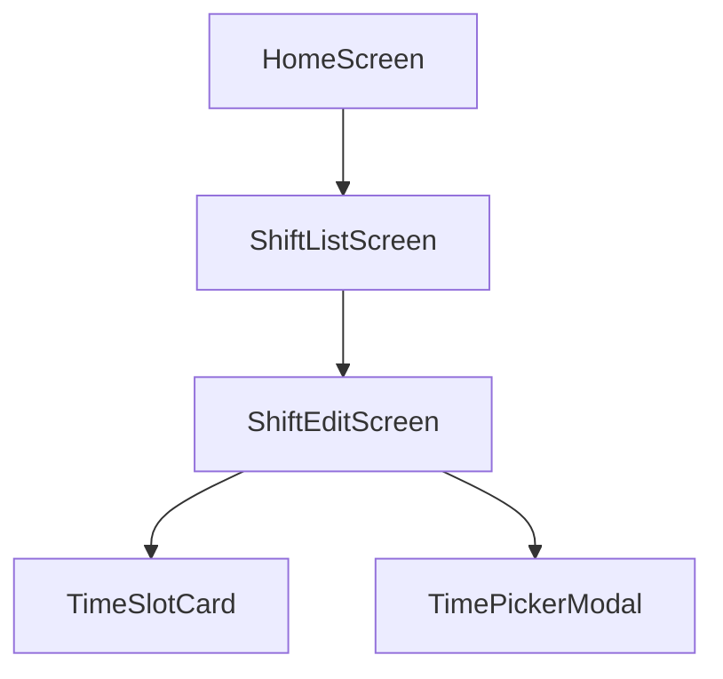

# 系统架构设计 (DESIGN)

## 1. 整体架构
基于 React Native 和 React Native Paper 构建。
采用 Screen + Component 模式。
状态管理暂时使用 React 本地状态 (useState/useReducer)，后续可接入 Context 或全局状态管理。

## 2. 数据模型
修改 `packages/app/src/types/shift.ts`：

```typescript
export interface TimeSlot {
  id: string;
  startTime: string; // "09:00"
  endTime: string;   // "18:00"
  mustCheckIn: boolean;
  checkInWindow: string; // "08:30-09:30"
  mustCheckOut: boolean;
  checkOutWindow: string; // "17:30-18:30"
}

export interface Shift {
  id: string;
  name: string;
  timeSlots: TimeSlot[];
}
```

## 3. 页面设计

### 3.1 首页 (HomeScreen)
*   位置：`src/screens/HomeScreen.tsx`
*   变更：在 `Grid` 组件中添加“班次管理”入口，图标使用 `calendar-clock` (MaterialCommunityIcons)。

### 3.2 班次列表页 (ShiftListScreen)
*   位置：`src/screens/shift/ShiftListScreen.tsx`
*   布局：
    *   顶部搜索栏 (`Searchbar`)
    *   “添加班次”按钮 (`Button` mode="contained")
    *   班次列表 (`FlatList`)
*   交互：
    *   点击“添加班次”跳转到 `ShiftEditScreen` (新建模式)。
    *   点击列表项跳转到 `ShiftEditScreen` (编辑模式)。

### 3.3 班次编辑页 (ShiftEditScreen)
*   位置：`src/screens/shift/ShiftEditScreen.tsx`
*   布局：
    *   班次名称输入框
    *   时段列表（支持展开/折叠或卡片式布局）
    *   每个时段包含：
        *   时间显示（点击弹出时间选择器）
        *   开关设置（必须打卡）
        *   打卡范围设置
    *   底部保存按钮
*   组件拆分：
    *   `TimeSlotCard`: 渲染单个时段的详细设置。

## 4. 接口契约
由于目前没有后端 API 文档，暂定使用 Mock 数据或本地存储。
*   `getShifts()`: 返回 `Shift[]`
*   `saveShift(shift: Shift)`: 保存或更新班次
*   `deleteShift(id: string)`: 删除班次

## 5. 依赖库
*   UI 组件库: `react-native-paper`
*   导航: `@react-navigation/native`
*   图标: `react-native-vector-icons/MaterialCommunityIcons`
*   时间选择: `react-native-paper-dates` (如果存在) 或 `@react-native-community/datetimepicker`。
    *   *检查 package.json 确认*

## 6. 模块依赖图

