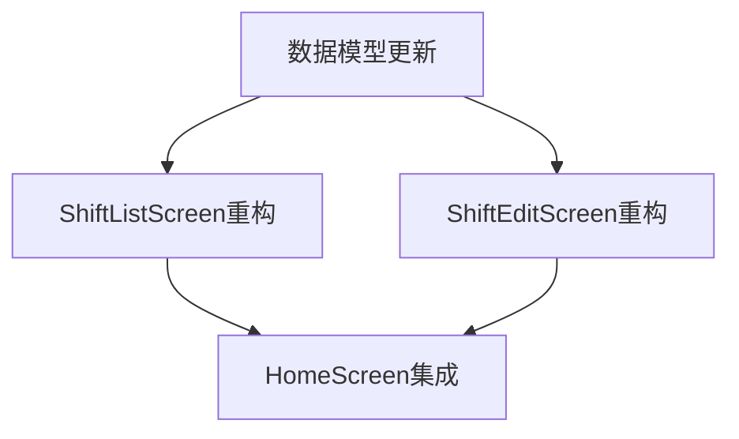

# 任务分解与计划 (TASK)

## 任务依赖图

## 任务清单

### T1: 数据模型更新
*   **输入**: `packages/app/src/types/shift.ts`
*   **输出**: 更新后的 `Shift` 和 `TimeSlot` 接口定义。
*   **验收标准**: 接口包含 `timeSlots` 数组，`TimeSlot` 包含所有必要字段。

### T2: ShiftListScreen 重构
*   **输入**: `packages/app/src/screens/shift/ShiftListScreen.tsx`
*   **输出**: 重构后的列表页。
*   **步骤**:
    1.  移除 FAB。
    2.  在 Searchbar 下方添加“添加班次”按钮。
    3.  修改 `renderItem` 以显示多时段信息。
    4.  更新 Mock 数据以符合新接口。
*   **验收标准**: 列表能正确显示多时段班次，UI 与参考设计接近。

### T3: ShiftEditScreen 重构
*   **输入**: `packages/app/src/screens/shift/ShiftEditScreen.tsx`
*   **输出**: 支持多时段编辑的页面。
*   **步骤**:
    1.  实现班次名称输入。
    2.  实现 `TimeSlotList` 逻辑（增删改）。
    3.  实现 `TimeSlotItem` UI（时间选择、开关）。
    4.  集成 `@react-native-community/datetimepicker`。
*   **验收标准**: 能添加/编辑/删除时段，能保存完整数据。

### T4: HomeScreen 集成
*   **输入**: `packages/app/src/screens/HomeScreen.tsx`
*   **输出**: 带有班次管理入口的首页。
*   **步骤**:
    1.  在 `常用功能` 区域添加 `MenuItem`。
    2.  确保导航跳转正确。
*   **验收标准**: 点击图标能跳转到班次列表页。
