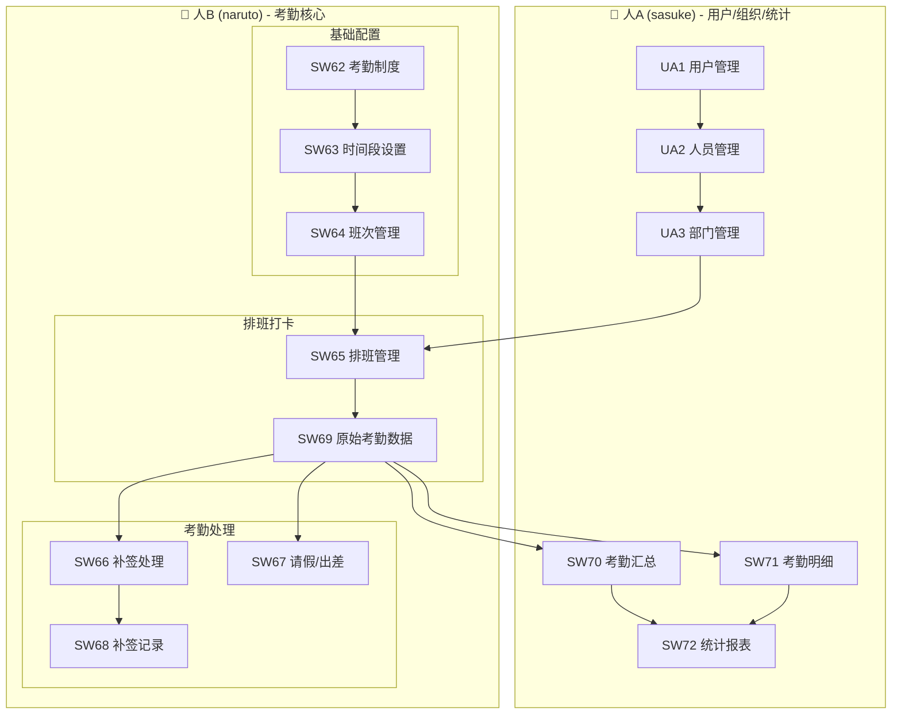
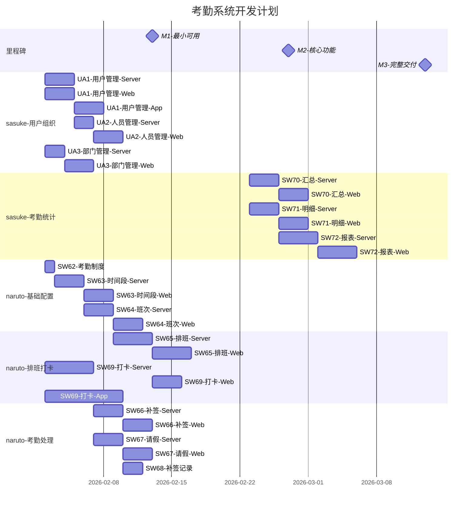
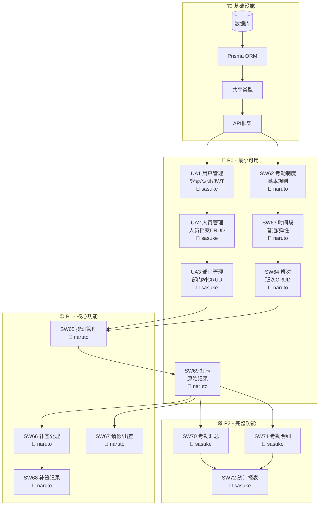
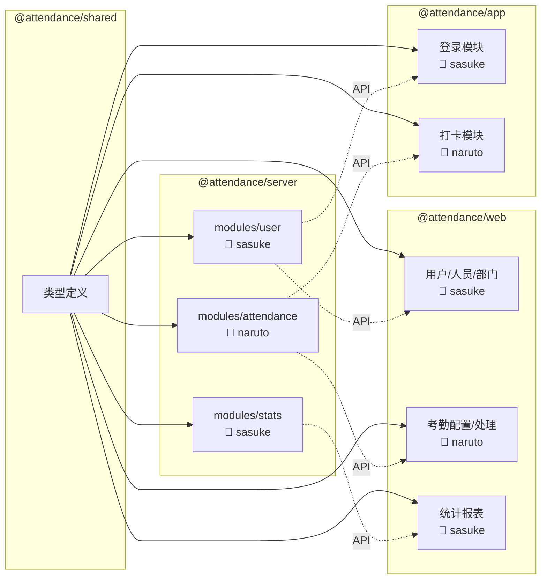
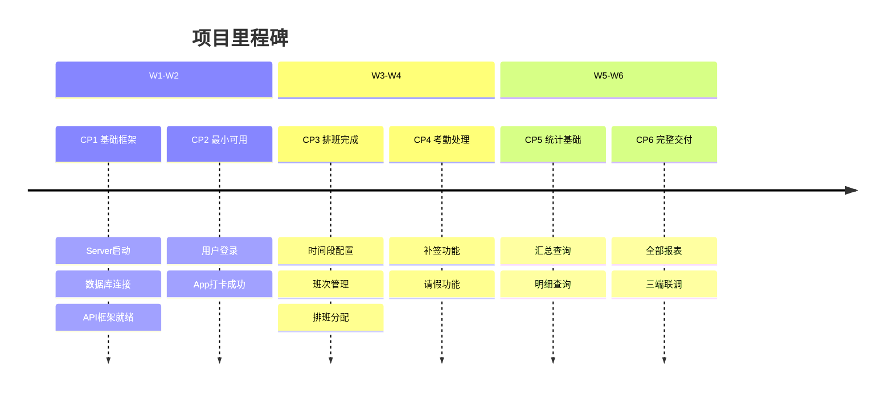

# 项目战斗地图

## 一、规格总览

---

## 二、甘特图

---

## 三、任务依赖图

---

## 四、模块依赖关系

---

## 五、优先级矩阵

| 优先级 | 规格 | 依赖 | 工时 | 负责人 |
|:------:|------|------|:----:|:------:|
| 🔴 P0 | UA1-用户管理 | - | 3d | sasuke |
| 🔴 P0 | UA2-人员管理 | UA1 | 2d | sasuke |
| 🔴 P0 | UA3-部门管理 | UA2 | 2d | sasuke |
| 🔴 P0 | SW62-考勤制度 | - | 0.5d | naruto |
| 🔴 P0 | SW63-时间段 | SW62 | 2d | naruto |
| 🔴 P0 | SW64-班次 | SW63 | 2d | naruto |
| � P0 | SW69-打卡 | SW65 | 3d | naruto |
| 🟡 P1 | SW65-排班 | UA3,SW64 | 3d | naruto |
| 🟡 P1 | SW66-补签 | SW69 | 2d | naruto |
| 🟡 P1 | SW67-请假 | UA2 | 2d | naruto |
| 🟡 P1 | SW68-补签记录 | SW66 | 1d | naruto |
| 🟢 P2 | SW70-汇总 | SW69 | 2d | sasuke |
| 🟢 P2 | SW71-明细 | SW69 | 2d | sasuke |
| 🟢 P2 | SW72-报表 | SW70,SW71 | 3d | sasuke |

---

## 六、检查点

