# 需求分析文档

## 一、业务全景图

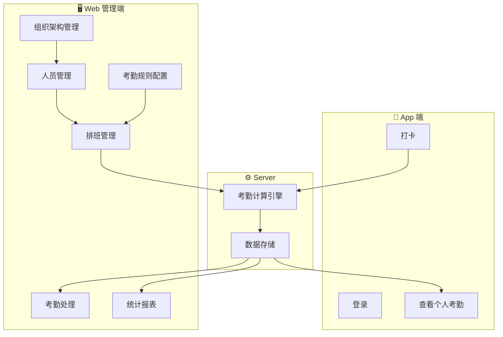

---

## 二、核心业务流程

### 2.1 考勤主流程

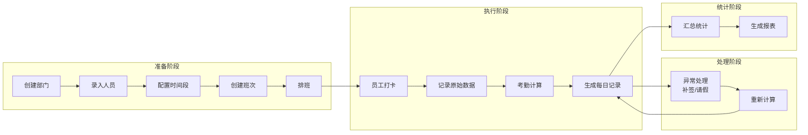

### 2.2 打卡流程详解

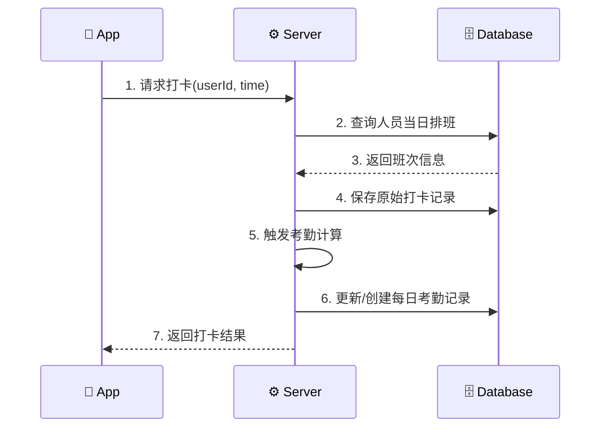

### 2.3 考勤计算流程

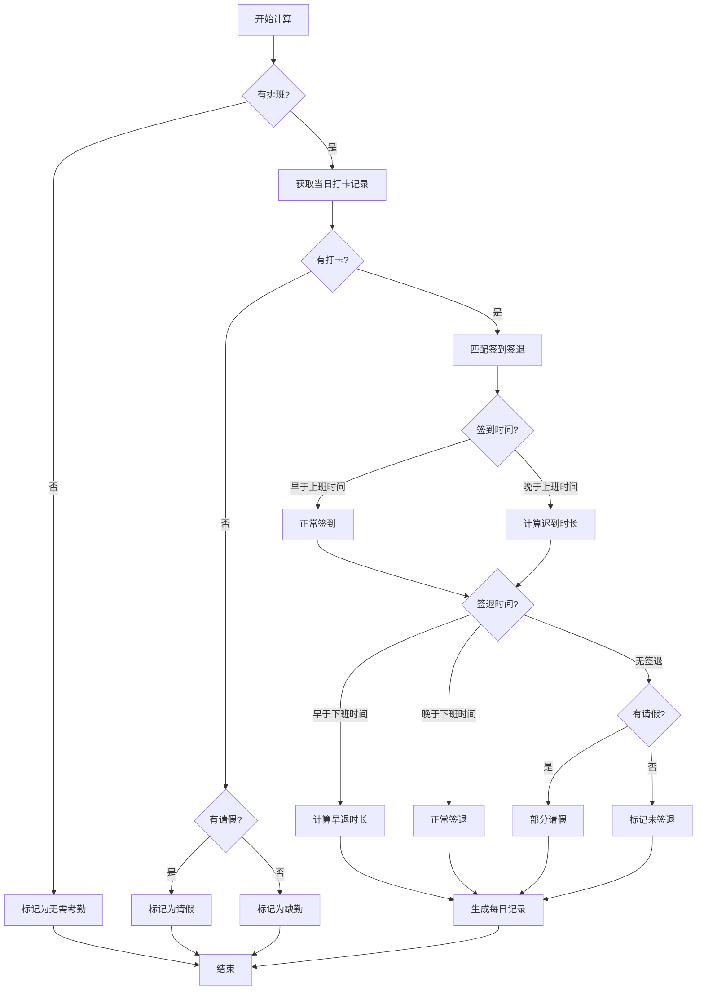

---

## 三、领域模型

### 3.1 核心实体关系

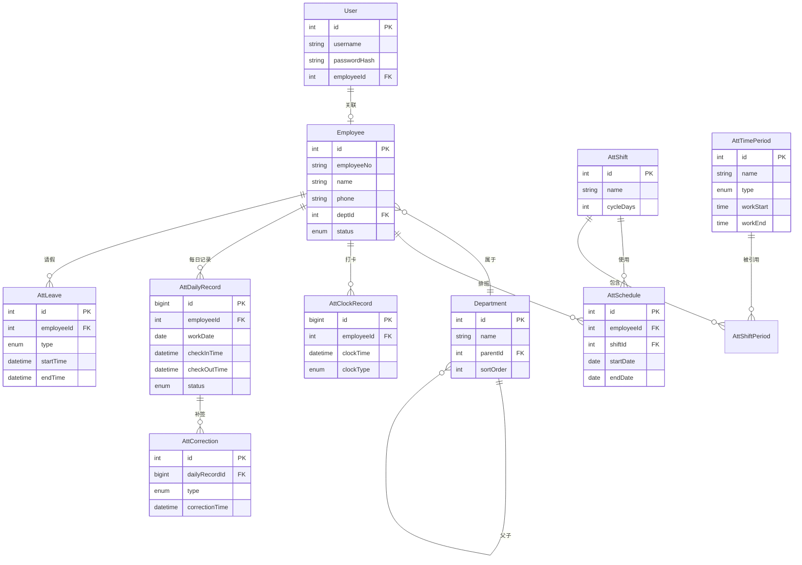

### 3.2 实体说明

| 实体 | 说明 | 负责人 |
|------|------|--------|
| User | 系统账号，用于登录认证 | sasuke |
| Employee | 人员档案，考勤主体 | sasuke |
| Department | 部门，树形结构 | sasuke |
| AttTimePeriod | 时间段，定义上下班时间 | naruto |
| AttShift | 班次，由多个时间段组成 | naruto |
| AttSchedule | 排班，人员与班次的关联 | naruto |
| AttClockRecord | 原始打卡记录 | naruto |
| AttDailyRecord | 每日考勤记录（计算结果） | naruto |
| AttCorrection | 补签记录 | naruto |
| AttLeave | 请假/出差记录 | naruto |

---

## 四、状态定义

### 4.1 人员状态

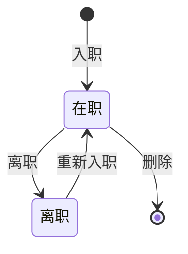

| 状态 | 说明 |
|------|------|
| active | 在职，可打卡、可排班 |
| inactive | 离职，不可打卡、保留历史数据 |

### 4.2 考勤状态

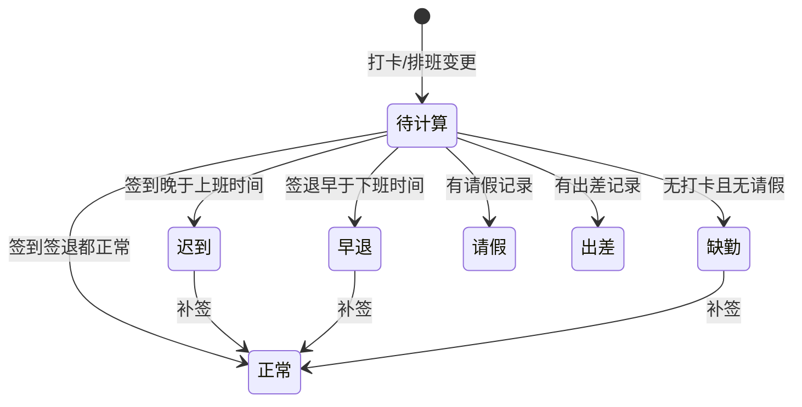

| 状态 | 代码 | 说明 |
|------|------|------|
| 正常 | normal | 签到签退都在规定时间内 |
| 迟到 | late | 签到时间晚于上班时间 |
| 早退 | early_leave | 签退时间早于下班时间 |
| 缺勤 | absent | 无打卡记录且无请假 |
| 请假 | leave | 有请假记录覆盖 |
| 出差 | business_trip | 有出差记录覆盖 |

### 4.3 请假状态

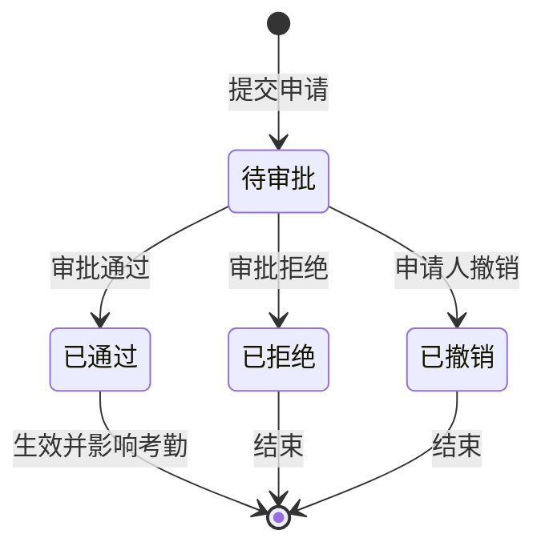

| 状态 | 代码 | 说明 |
|------|------|------|
| 待审批 | pending | 已提交，等待审批 |
| 已通过 | approved | 审批通过，影响考勤计算 |
| 已拒绝 | rejected | 审批拒绝，不影响考勤 |
| 已撤销 | cancelled | 申请人主动撤销 |

### 4.4 请假审批流程

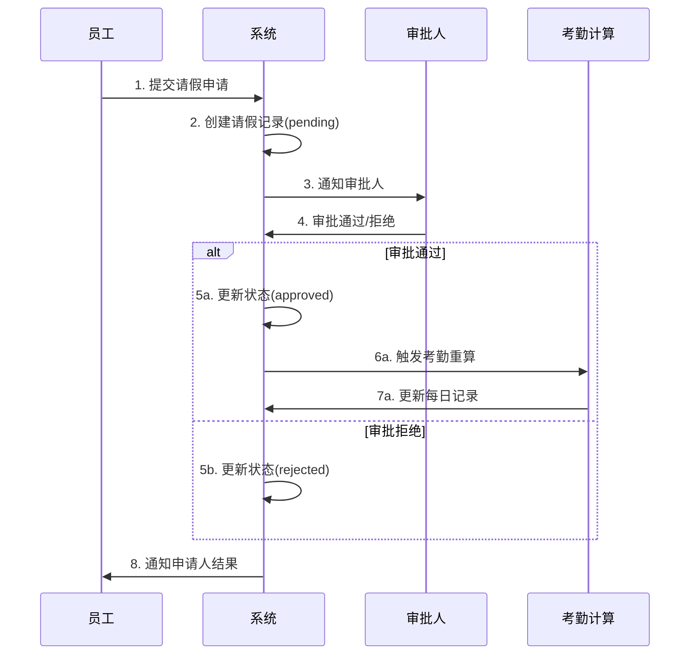

---

## 五、模块接口边界

### 5.1 模块依赖关系

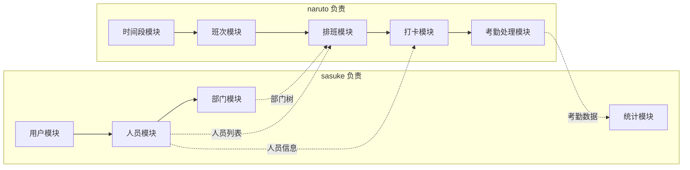

### 5.2 跨模块接口定义

#### sasuke 提供给 naruto 的接口

| 接口 | 方法 | 路径 | 说明 | 调用方 |
|------|------|------|------|--------|
| 获取部门树 | GET | /api/v1/departments/tree | 返回完整部门树 | 排班、统计页面 |
| 获取部门人员 | GET | /api/v1/departments/:id/employees | 返回部门下所有人员 | 排班页面 |
| 获取人员信息 | GET | /api/v1/employees/:id | 返回单个人员详情 | 打卡、考勤记录 |
| 批量获取人员 | POST | /api/v1/employees/batch | 批量查询人员信息 | 统计报表 |

#### naruto 提供给 sasuke 的接口

| 接口 | 方法 | 路径 | 说明 | 调用方 |
|------|------|------|------|--------|
| 获取每日考勤记录 | GET | /api/v1/attendance/daily | 按条件查询每日记录 | 统计模块 |
| 获取考勤汇总数据 | GET | /api/v1/attendance/summary | 返回汇总统计数据 | 统计模块 |
| 获取原始打卡记录 | GET | /api/v1/attendance/clock-records | 返回原始打卡数据 | 统计模块 |

### 5.3 数据格式约定

#### 人员信息（sasuke 提供）

```typescript
interface Employee {
  id: number;
  employeeNo: string;      // 人员编号
  name: string;            // 姓名
  phone?: string;          // 手机号
  deptId: number;          // 部门ID
  deptName: string;        // 部门名称（冗余，方便显示）
  status: 'active' | 'inactive';
}
```

#### 部门树（sasuke 提供）

```typescript
interface DepartmentTree {
  id: number;
  name: string;
  parentId?: number;
  children: DepartmentTree[];
  employeeCount: number;   // 部门人数（含子部门）
}
```

#### 每日考勤记录（naruto 提供）

```typescript
interface DailyRecord {
  id: number;
  employeeId: number;
  employeeNo: string;      // 冗余
  employeeName: string;    // 冗余
  deptId: number;          // 冗余
  deptName: string;        // 冗余
  workDate: string;        // YYYY-MM-DD
  shiftName?: string;      // 班次名称
  periodName?: string;     // 时间段名称
  checkInTime?: string;    // ISO datetime
  checkOutTime?: string;   // ISO datetime
  status: AttendanceStatus;
  actualMinutes: number;   // 实际出勤分钟
  effectiveMinutes: number;// 有效出勤分钟
  lateMinutes: number;     // 迟到分钟
  earlyLeaveMinutes: number;// 早退分钟
  absentMinutes: number;   // 缺勤分钟
  remark?: string;
}
```

---

## 六、数据流向

### 6.1 写入流向

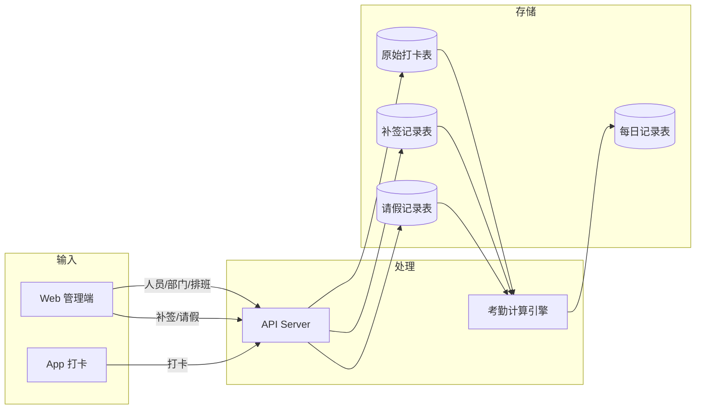

### 6.2 读取流向

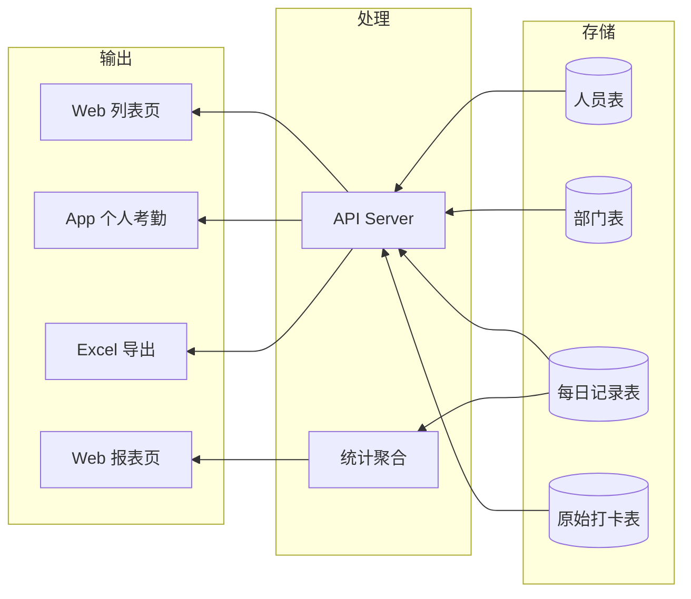

---

## 七、关键业务规则

### 7.1 考勤日切换

| 规则 | 说明 |
|------|------|
| 默认切换点 | 凌晨 05:00 |
| 切换逻辑 | 05:00 前的打卡归属前一天，05:00 后归属当天 |
| 配置位置 | att_settings 表，key = day_switch_time |

### 7.2 迟到/早退判定

| 场景 | 判定规则 |
|------|----------|
| 迟到 | 签到时间 > 上班时间 + 宽限期 |
| 早退 | 签退时间 < 下班时间 - 宽限期 |
| 缺勤 | 无签到且无签退且无请假 |
| 宽限期 | 可在时间段规则中配置 |

### 7.3 弹性工时计算

| 计算方式 | 说明 |
|----------|------|
| 首尾打卡 | 有效工时 = 最后打卡 - 最早打卡 - 休息时间 |
| 两两累积 | 有效工时 = Σ(偶数次打卡 - 奇数次打卡) |
| 有效间隔 | 两次打卡间隔 < 配置值则忽略 |

### 7.4 请假与考勤

| 规则 | 说明 |
|------|------|
| 审批生效 | 只有 approved 状态的请假才影响考勤计算 |
| 全天请假 | 当日考勤状态 = leave，不计缺勤 |
| 部分请假 | 请假时段不计入缺勤，其余时段正常计算 |
| 请假时长 | 按实际请假时间计入请假时长统计 |
| 审批后重算 | 审批通过后自动触发相关日期的考勤重算 |

### 7.5 多班次支持

| 规则 | 说明 |
|------|------|
| 一天多时间段 | 一个班次可配置多个时间段（最多8个） |
| 分段计算 | 每个时间段独立计算签到签退 |
| 汇总统计 | 每日记录汇总所有时间段的出勤情况 |
| 示例 | 早班 08:00-12:00 + 午班 14:00-18:00 |

---

## 八、非功能需求

### 8.1 性能要求

| 场景 | 要求 |
|------|------|
| 打卡响应 | < 500ms |
| 列表查询 | < 1s（1000条以内） |
| 报表生成 | < 5s（月报表） |
| 并发打卡 | 支持 100 人同时打卡 |

### 8.2 数据保留

| 数据类型 | 保留期限 |
|----------|----------|
| 原始打卡记录 | 2 年 |
| 每日考勤记录 | 2 年 |
| 统计报表 | 永久 |

### 8.3 安全要求

| 要求 | 说明 |
|------|------|
| 认证 | JWT Token，有效期 24 小时 |
| 权限 | 管理员可操作所有，普通用户只能查看自己 |
| 数据隔离 | 按部门隔离数据访问 |

---

## 九、已确认决策

| # | 问题 | 决策 | 影响 |
|---|------|------|------|
| 1 | 是否需要审批流程？ | ✅ 是 | SW67 需增加审批状态流转 |
| 2 | 是否支持多班次？ | ✅ 是 | 一天可配置多个时间段 |
| 3 | App 是否需要定位打卡？ | ❌ 否 | 简化 App 打卡逻辑 |
| 4 | 是否需要人脸识别打卡？ | ❌ 否 | 简化打卡方式 |
| 5 | 报表是否需要导出 PDF？ | ❌ 否 | 仅支持 Excel 导出 |
