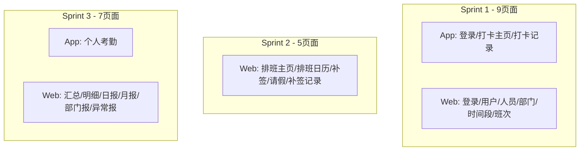
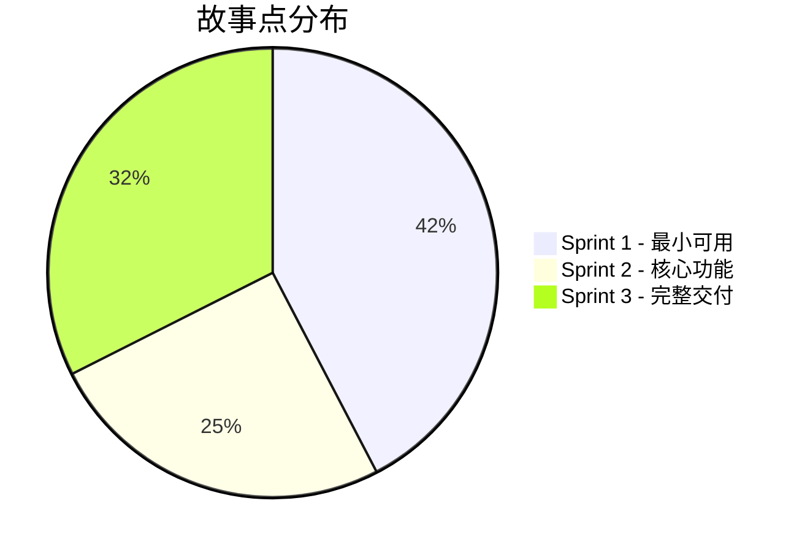
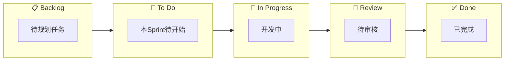

# 敏捷任务清单

## Sprint 概览

| Sprint | 周期 | 目标 | 交付物 |
|--------|------|------|--------|
| Sprint 1 | W1-W2 | 最小可用 | 用户登录 + App打卡 |
| Sprint 2 | W3-W4 | 核心功能 | 排班 + 考勤处理 |
| Sprint 3 | W5-W6 | 完整交付 | 统计报表 + 联调 |

---

## 前端代码生成流程


**工具链：**
1. **截图** - 对目标考勤产品进行界面截图
2. **Stitch** (stitch.withgoogle.com) - 输入截图 + 提示词，生成 UI 原型
3. **AI Studio** - 导出原型，自动生成前端可运行代码
4. **集成** - 将生成代码集成到 @attendance/web 或 @attendance/app

**提示词模板：**
```
按照图片中的内容重新设计一个考勤应用，功能：
1）支持 [具体功能描述]
2）界面风格：[简洁/现代/企业级]
3）技术栈：[React/React Native]
```

---

## Sprint 1：最小可用（W1-W2）

### 🎨 UI 原型准备（Sprint 开始前）

| 端 | 页面 | 截图目标 | Stitch 提示词要点 | 负责人 |
|----|------|----------|-------------------|--------|
| App | 登录页 | 钉钉/企业微信登录页 | 简洁登录表单，支持账号密码登录 | sasuke |
| App | 打卡主页 | 钉钉考勤打卡页 | 大打卡按钮，显示当前时间、打卡状态、今日记录 | naruto |
| App | 打卡记录 | 钉钉打卡记录页 | 日历视图+列表，显示每日打卡详情 | naruto |
| Web | 登录页 | 企业管理后台登录 | 居中表单，品牌 Logo | sasuke |
| Web | 用户列表 | 通用后台用户管理 | 表格+搜索+分页+操作按钮 | sasuke |
| Web | 人员管理 | 人事管理系统 | 表格+搜索+入职离职状态 | sasuke |
| Web | 部门管理 | 树形组织架构页面 | 左侧部门树+右侧人员列表 | sasuke |
| Web | 时间段设置 | 考勤规则配置页 | 表单配置，时间选择器 | naruto |
| Web | 班次管理 | 排班系统班次页 | 周视图表格，时间段色块 | naruto |

**交付物：** 9 个页面的前端代码骨架

---

### 🔴 Epic: UA1 用户管理（sasuke）

| ID | 任务 | 端 | 故事点 | 验收标准 |
|----|------|:--:|:------:|----------|
| UA1-01 | 用户表 Prisma Model 定义 | Server | 1 | Model 可生成，字段完整 |
| UA1-02 | 用户 CRUD Service | Server | 2 | 增删改查方法可用 |
| UA1-03 | 用户 CRUD API | Server | 2 | RESTful 接口，响应格式正确 |
| UA1-04 | 密码加密与验证 | Server | 1 | bcrypt 加密，验证通过 |
| UA1-05 | JWT 生成与验证中间件 | Server | 2 | Token 生成、解析、过期处理 |
| UA1-06 | 登录 API | Server | 2 | 账号密码登录，返回 Token |
| UA1-07 | 登录页面 UI | Web | 2 | 表单、验证、错误提示 |
| UA1-08 | 登录状态管理 | Web | 2 | Token 存储、自动刷新、登出 |
| UA1-09 | 用户列表页面 | Web | 3 | 表格、分页、搜索 |
| UA1-10 | 用户新增/编辑弹窗 | Web | 2 | 表单、验证、提交 |
| UA1-11 | App 登录页面 | App | 2 | 表单、验证、错误提示 |
| UA1-12 | App Token 存储 | App | 1 | SecureStore 存储 |

**小计：22 故事点**

---

### 🔴 Epic: UA2 人员管理（sasuke）

| ID | 任务 | 端 | 故事点 | 验收标准 |
|----|------|:--:|:------:|----------|
| UA2-01 | 人员表 Prisma Model | Server | 1 | 与用户表关联正确 |
| UA2-02 | 人员 CRUD Service | Server | 2 | 增删改查、入职离职状态 |
| UA2-03 | 人员 CRUD API | Server | 2 | RESTful 接口 |
| UA2-04 | 人员列表页面 | Web | 3 | 表格、状态筛选、搜索 |
| UA2-05 | 人员新增/编辑弹窗 | Web | 2 | 表单、部门选择、用户关联 |
| UA2-06 | 人员入职/离职操作 | Web | 1 | 状态变更、确认提示 |

**小计：11 故事点**

---

### 🔴 Epic: UA3 部门管理（sasuke）

| ID | 任务 | 端 | 故事点 | 验收标准 |
|----|------|:--:|:------:|----------|
| UA3-01 | 部门表 Prisma Model | Server | 1 | 自引用关系正确 |
| UA3-02 | 部门树 Service | Server | 3 | 递归查询、增删改、移动节点 |
| UA3-03 | 部门 CRUD API | Server | 2 | 树形结构返回 |
| UA3-04 | 部门树组件 | Web | 3 | 树形展示、展开收起、选择 |
| UA3-05 | 部门管理页面 | Web | 3 | 新增、编辑、删除、拖拽排序 |
| UA3-06 | 人员-部门关联 | Web | 1 | 人员表单中选择部门 |

**小计：13 故事点**

---

### 🔴 Epic: SW62 考勤制度（naruto）

| ID | 任务 | 端 | 故事点 | 验收标准 |
|----|------|:--:|:------:|----------|
| SW62-01 | 考勤设置表 Prisma Model | Server | 1 | key-value 结构 |
| SW62-02 | 考勤设置 Service | Server | 1 | 读取、更新设置 |
| SW62-03 | 考勤设置 API | Server | 1 | GET/PUT 接口 |
| SW62-04 | 默认设置初始化 | Server | 1 | day_switch_time=05:00 |

**小计：4 故事点**

---

### 🔴 Epic: SW63 时间段设置（naruto）

| ID | 任务 | 端 | 故事点 | 验收标准 |
|----|------|:--:|:------:|----------|
| SW63-01 | 时间段表 Prisma Model | Server | 1 | 普通/弹性字段完整 |
| SW63-02 | 时间段 CRUD Service | Server | 2 | 增删改查，类型区分 |
| SW63-03 | 时间段 CRUD API | Server | 2 | RESTful 接口 |
| SW63-04 | 异常规则 JSON Schema | Shared | 1 | 迟到/早退/缺勤规则定义 |
| SW63-05 | 时间段列表页面 | Web | 2 | 表格、类型筛选 |
| SW63-06 | 普通时间段表单 | Web | 3 | 时间选择、规则配置 |
| SW63-07 | 弹性时间段表单 | Web | 2 | 计算方式、间隔配置 |

**小计：13 故事点**

---

### 🔴 Epic: SW64 班次管理（naruto）

| ID | 任务 | 端 | 故事点 | 验收标准 |
|----|------|:--:|:------:|----------|
| SW64-01 | 班次表 Prisma Model | Server | 1 | 班次+关联表 |
| SW64-02 | 班次 CRUD Service | Server | 2 | 含时间段关联 |
| SW64-03 | 班次 CRUD API | Server | 2 | 嵌套返回时间段 |
| SW64-04 | 班次列表页面 | Web | 2 | 表格、周期显示 |
| SW64-05 | 班次编辑页面 | Web | 3 | 周视图、时间段拖拽 |
| SW64-06 | 时间段选择器组件 | Web | 2 | 下拉多选、预览 |

**小计：12 故事点**

---

### 🔴 Epic: SW69 原始考勤/打卡（naruto）

| ID | 任务 | 端 | 故事点 | 验收标准 |
|----|------|:--:|:------:|----------|
| SW69-01 | 打卡记录表 Prisma Model | Server | 1 | BigInt ID，索引 |
| SW69-02 | 打卡 Service | Server | 2 | 记录打卡、查询 |
| SW69-03 | 打卡 API | Server | 2 | POST 打卡，GET 查询 |
| SW69-04 | 打卡记录查询 API | Server | 2 | 时间范围筛选 |
| SW69-05 | 原始考勤列表页面 | Web | 3 | 部门树+表格、筛选条件 |
| SW69-06 | 考勤数据导出 | Web | 2 | Excel 导出 |
| SW69-07 | App 打卡主页 | App | 3 | 打卡按钮、状态显示 |
| SW69-08 | App 打卡记录 | App | 2 | 今日打卡列表 |
| SW69-09 | Web 手动打卡 | Web | 2 | 管理员代打卡功能 |

**小计：19 故事点**

---

### Sprint 1 汇总

| 负责人 | Epic | 故事点 |
|--------|------|:------:|
| sasuke | UA1 用户管理 | 22 |
| sasuke | UA2 人员管理 | 11 |
| sasuke | UA3 部门管理 | 13 |
| naruto | SW62 考勤制度 | 4 |
| naruto | SW63 时间段 | 13 |
| naruto | SW64 班次 | 12 |
| naruto | SW69 打卡 | 19 |
| **合计** | | **94** |

| 负责人 | 故事点 |
|--------|:------:|
| sasuke | 46 |
| naruto | 48 |

---

## Sprint 2：核心功能（W3-W4）

### 🎨 UI 原型准备（Sprint 开始前）

| 端 | 页面 | 截图目标 | Stitch 提示词要点 | 负责人 |
|----|------|----------|-------------------|--------|
| Web | 排班主页 | 钉钉排班管理 | 左侧部门树+右侧月历视图 | naruto |
| Web | 排班日历 | 排班系统日历 | 月视图，人员行+日期列，班次色块 | naruto |
| Web | 补签处理 | 考勤异常处理页 | 异常列表+补签操作弹窗 | naruto |
| Web | 请假管理 | 请假审批列表 | 表格+状态筛选+新增弹窗 | naruto |
| Web | 补签记录 | 操作日志页面 | 记录列表+时间筛选 | naruto |

**交付物：** 5 个页面的前端代码骨架

---

### 🟡 Epic: SW65 排班管理（naruto）

| ID | 任务 | 端 | 故事点 | 验收标准 |
|----|------|:--:|:------:|----------|
| SW65-01 | 排班表 Prisma Model | Server | 1 | 人员-班次-有效期 (已完成) |
| SW65-02 | 排班 Service | Server | 3 | 个人排班、批量排班、冲突检测 (已完成) |
| SW65-03 | 排班 CRUD API | Server | 2 | 按人员/部门查询 (已完成) |
| SW65-04 | 获取人员当日班次 API | Server | 2 | 打卡时调用 (已完成) |
| SW65-05 | 排班主页面 | Web | 3 | 部门树+人员列表 |
| SW65-06 | 排班日历视图 | Web | 5 | 月视图、班次色块 |
| SW65-07 | 排班编辑弹窗 | Web | 3 | 选班次、设有效期 |
| SW65-08 | 批量排班功能 | Web | 3 | 选部门/多人、批量设置 |

**小计：22 故事点**

---

### 🟡 Epic: SW66 补签处理（naruto）

| ID | 任务 | 端 | 故事点 | 验收标准 |
|----|------|:--:|:------:|----------|
| SW66-01 | 每日考勤记录表 Model | Server | 1 | 状态、时长字段 |
| SW66-02 | 考勤计算 Service | Server | 5 | 状态判定、时长计算 |
| SW66-03 | 异常记录查询 API | Server | 2 | 按部门、状态筛选 |
| SW66-04 | 补签 API | Server | 2 | 补签到/补签退 |
| SW66-05 | 异常记录列表页面 | Web | 3 | 部门树+表格 |
| SW66-06 | 补签操作弹窗 | Web | 2 | 时间选择、确认 |

**小计：15 故事点**

---

### 🟡 Epic: SW67 请假/出差（naruto）

| ID | 任务 | 端 | 故事点 | 验收标准 |
|----|------|:--:|:------:|----------|
| SW67-01 | 请假表 Prisma Model | Server | 1 | 类型、状态枚举 |
| SW67-02 | 请假 CRUD Service | Server | 2 | 增删改查、时间校验 |
| SW67-03 | 请假 CRUD API | Server | 2 | RESTful 接口 |
| SW67-04 | 请假与考勤关联 | Server | 2 | 计算时扣除请假时段 |
| SW67-05 | 请假列表页面 | Web | 3 | 部门树+表格、类型筛选 |
| SW67-06 | 请假新增/编辑弹窗 | Web | 3 | 时间范围、类型选择 |

**小计：13 故事点**

---

### 🟡 Epic: SW68 补签记录（naruto）

| ID | 任务 | 端 | 故事点 | 验收标准 |
|----|------|:--:|:------:|----------|
| SW68-01 | 补签记录表 Model | Server | 1 | 关联每日记录 |
| SW68-02 | 补签记录 Service | Server | 1 | 查询、编辑、删除 |
| SW68-03 | 补签记录 API | Server | 1 | RESTful 接口 |
| SW68-04 | 补签记录列表页面 | Web | 2 | 部门树+表格 |
| SW68-05 | 补签记录编辑/删除 | Web | 1 | 操作确认 |

**小计：6 故事点**

---

### Sprint 2 汇总

| 负责人 | Epic | 故事点 |
|--------|------|:------:|
| naruto | SW65 排班 | 22 |
| naruto | SW66 补签 | 15 |
| naruto | SW67 请假 | 13 |
| naruto | SW68 补签记录 | 6 |
| **合计** | | **56** |

| 负责人 | 故事点 |
|--------|:------:|
| sasuke | 0 |
| naruto | 56 |

> ⚠️ Sprint 2 sasuke 可提前进入 Sprint 3 的统计模块开发

---

## Sprint 3：完整交付（W5-W6）

### 🎨 UI 原型准备（Sprint 开始前）

| 端 | 页面 | 截图目标 | Stitch 提示词要点 | 负责人 |
|----|------|----------|-------------------|--------|
| Web | 考勤汇总 | 考勤统计汇总页 | 部门树+汇总表格+导出按钮 | sasuke |
| Web | 考勤明细 | 考勤明细查询页 | 多条件筛选+明细表格+状态标签 | sasuke |
| Web | 日报表 | 数据报表页面 | 图表（柱状图）+数据表格 | sasuke |
| Web | 月报表 | 月度统计报表 | 趋势图+汇总数据卡片 | sasuke |
| Web | 部门报表 | 部门对比报表 | 横向柱状图+排名列表 | sasuke |
| Web | 异常报表 | 异常统计页面 | 饼图+异常类型分布 | sasuke |
| App | 个人考勤 | 钉钉个人考勤页 | 月历+统计卡片+明细列表 | sasuke |

**交付物：** 7 个页面的前端代码骨架

---

### 🟢 Epic: SW70 考勤汇总（sasuke）

| ID | 任务 | 端 | 故事点 | 验收标准 |
|----|------|:--:|:------:|----------|
| SW70-01 | 汇总统计 Service | Server | 3 | 按人员/部门汇总 |
| SW70-02 | 汇总查询 API | Server | 2 | 时间范围、部门筛选 |
| SW70-03 | 汇总列表页面 | Web | 3 | 部门树+表格 |
| SW70-04 | 汇总数据导出 | Web | 2 | Excel 导出 |
| SW70-05 | 明细跳转链接 | Web | 1 | 点击查看明细 |

**小计：11 故事点**

---

### 🟢 Epic: SW71 考勤明细（sasuke）

| ID | 任务 | 端 | 故事点 | 验收标准 |
|----|------|:--:|:------:|----------|
| SW71-01 | 明细查询 Service | Server | 2 | 多条件筛选 |
| SW71-02 | 明细查询 API | Server | 2 | 分页、状态筛选 |
| SW71-03 | 手动计算考勤 API | Server | 3 | 重新计算指定范围 |
| SW71-04 | 明细列表页面 | Web | 3 | 部门树+表格、状态筛选 |
| SW71-05 | 明细数据导出 | Web | 2 | Excel 导出 |
| SW71-06 | 手动计算按钮 | Web | 1 | 触发重算、进度提示 |

**小计：13 故事点**

---

### 🟢 Epic: SW72 统计报表（sasuke）

| ID | 任务 | 端 | 故事点 | 验收标准 |
|----|------|:--:|:------:|----------|
| SW72-01 | 日报表 Service | Server | 2 | 每日统计数据 |
| SW72-02 | 月报表 Service | Server | 2 | 每月统计数据 |
| SW72-03 | 部门报表 Service | Server | 2 | 按部门统计 |
| SW72-04 | 年报表 Service | Server | 2 | 年度统计 |
| SW72-05 | 异常报表 Service | Server | 2 | 异常情况统计 |
| SW72-06 | 报表 API | Server | 2 | 统一报表接口 |
| SW72-07 | 报表主页面 | Web | 2 | 报表类型选择 |
| SW72-08 | 日报表页面 | Web | 3 | 图表+表格 |
| SW72-09 | 月报表页面 | Web | 3 | 图表+表格 |
| SW72-10 | 部门报表页面 | Web | 3 | 图表+表格 |
| SW72-11 | 年报表页面 | Web | 2 | 图表+表格 |
| SW72-12 | 异常报表页面 | Web | 2 | 图表+表格 |
| SW72-13 | 报表导出 | Web | 2 | PDF/Excel 导出 |
| SW72-14 | App 个人考勤页 | App | 3 | 月历+统计+明细 |

**小计：32 故事点**

---

### 🔵 Epic: 集成联调（共同）

| ID | 任务 | 端 | 故事点 | 验收标准 |
|----|------|:--:|:------:|----------|
| INT-01 | Server-Web 联调 | All | 3 | 全流程跑通 |
| INT-02 | Server-App 联调 | All | 3 | 打卡流程跑通 |
| INT-03 | 端到端测试 | All | 3 | 主流程自动化测试 |
| INT-04 | 性能测试 | Server | 2 | 并发打卡压测 |
| INT-05 | Bug 修复缓冲 | All | 5 | 预留修复时间 |

**小计：16 故事点**

---

### Sprint 3 汇总

| 负责人 | Epic | 故事点 |
|--------|------|:------:|
| sasuke | SW70 汇总 | 11 |
| sasuke | SW71 明细 | 13 |
| sasuke | SW72 报表 | 32 |
| 共同 | 集成联调 | 16 |
| **合计** | | **72** |

| 负责人 | 故事点 |
|--------|:------:|
| sasuke | 56 |
| naruto | 0 |
| 共同 | 16 |

> ⚠️ Sprint 3 naruto 可协助联调或提前进入下一版本规划

---

## 全项目汇总

### UI 原型准备清单



| Sprint | App 页面 | Web 页面 | 合计 |
|--------|:--------:|:--------:|:----:|
| Sprint 1 | 3 | 6 | 9 |
| Sprint 2 | 0 | 5 | 5 |
| Sprint 3 | 1 | 6 | 7 |
| **总计** | **4** | **17** | **21** |

### 故事点分布



| Sprint | sasuke | naruto | 共同 | 合计 |
|--------|:------:|:------:|:----:|:----:|
| Sprint 1 | 46 | 48 | - | 94 |
| Sprint 2 | 0 | 56 | - | 56 |
| Sprint 3 | 56 | 0 | 16 | 72 |
| **总计** | **102** | **104** | **16** | **222** |

### 工作量平衡说明

| 负责人 | 总故事点 | 占比 |
|--------|:--------:|:----:|
| sasuke | 102 | 46% |
| naruto | 104 | 47% |
| 共同 | 16 | 7% |

✅ 工作量基本均衡

---

## 任务状态看板



### 当前状态（Sprint 1）

| 状态 | sasuke 任务 | naruto 任务 |
|------|-------------|-------------|
| ✅ Done | - | - |
| 👀 Review | - | - |
| 🔨 In Progress | - | - |
| 📝 To Do | UA1-01~12, UA2-01~06, UA3-01~06 | SW62-01~04, SW63-01~07, SW64-01~06, SW69-01~09 |
| 📋 Backlog | SW70, SW71, SW72 | SW65, SW66, SW67, SW68 |
