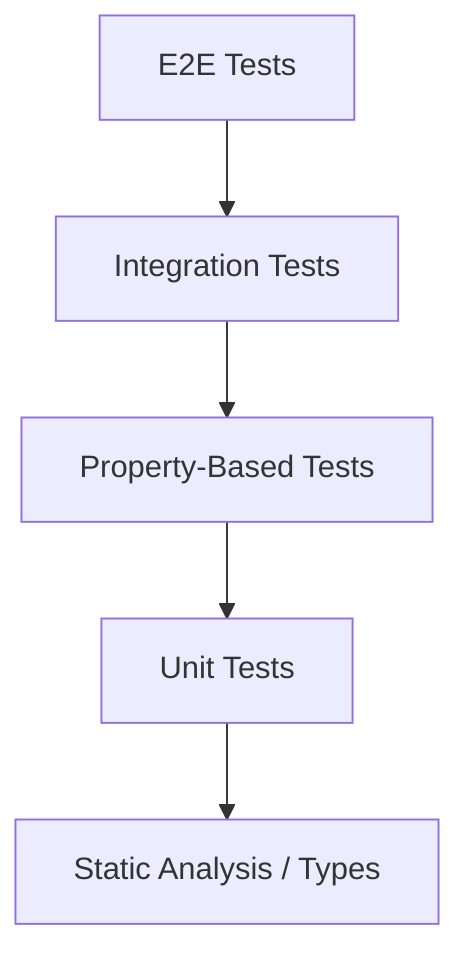

# DESIGN - 属性测试实施架构

## 1. 总体架构

### 1.1 测试金字塔位置
属性测试 (Property-Based Testing, PBT) 将作为单元测试的有力补充，位于测试金字塔的底部偏上位置。



### 1.2 技术架构
- **运行环境**: Vitest (与现有测试框架一致)
- **核心库**: `fast-check`
- **断言库**: Vitest 内置断言
- **辅助库**: `testcontainers` (如果涉及数据库状态的 PBT)

## 2. 详细设计

### 2.1 目录与文件结构
为了保持代码组织的清晰性，PBT 文件将与被测代码同目录，但使用不同的后缀。

```
packages/server/src/
├── modules/
│   └── attendance/
│       └── domain/
│           ├── attendance-calculator.ts       # 源码
│           ├── attendance-calculator.test.ts  # 传统单元测试 (Example-based)
│           └── attendance-calculator.pbt.test.ts # 属性测试 (Property-based)
└── common/
    └── test/
        └── arbitraries/                       # 可复用的生成器
            ├── time-period.arb.ts
            ├── shift.arb.ts
            └── user.arb.ts
```

### 2.2 核心组件：生成器 (Arbitraries)
为了提高复用性，我们将建立领域特定的生成器库。

#### L1: 基础类型生成器
- `emailArb`: 生成符合格式的邮箱。
- `phoneArb`: 生成手机号。
- `timestampArb`: 生成合理范围内的时间戳。

#### L2: 领域对象生成器
- `timePeriodArb`: 生成 `start < end` 的时间段。
- `shiftArb`: 生成包含合法时间段和休息时间的班次。
- `attendanceRecordArb`: 生成打卡记录序列。

### 2.3 执行策略 (CI/CD 集成)

#### 开发环境 (Local)
- **命令**: `npm run test:pbt`
- **配置**: 默认运行 100 次迭代 (numRuns: 100)。
- **目标**: 快速反馈，验证基本属性。

#### 持续集成 (CI)
- **命令**: `npm run test:pbt:ci`
- **配置**: 运行 1000+ 次迭代 (numRuns: 1000)，开启 `verbose` 模式。
- **目标**: 深度扫描，利用算力发现边缘 Case。
- **触发**: Nightly Build 或 Release 分支合并。

### 2.4 质量保证流程

#### PBT 编写规范
1.  **不重复实现逻辑**: Property 的验证逻辑不能简单地复制业务逻辑，而应验证不变量。
2.  **收敛性**: 确保生成的测试数据最终能覆盖有效路径，避免大量的 `pre` (precondition) 过滤导致测试无效。
3.  **确定性**: 所有的随机性必须由 `fast-check` 的 seed 控制，失败时必须打印 seed 以便重现。

#### Code Review 检查点
- [ ] 生成器是否覆盖了业务边界（如跨天、空集合、极大值）？
- [ ] Property 是否验证了核心不变量而非实现细节？
- [ ] 是否存在过度过滤 (Too many skipped runs)？

## 3. 实施路线图映射
基于 CONSENSUS 文档的阶段划分，设计具体的实施任务包。

- **Package A (Infrastructure)**: 配置 Vitest，创建 `common/test/arbitraries`，添加 npm scripts。
- **Package B (Core Domain)**: 实现 `time-period` 和 `attendance-calculator` 的 PBT。
- **Package C (Scheduling)**: 实现排班算法的 PBT。
- **Package D (Business Flow)**: 实现补卡、请假流程的状态机测试。

## 4. 风险控制设计
- **性能熔断**: 单个 PBT 文件运行时间超过 5s 报警。
- **复杂度隔离**: 对于极其复杂的生成逻辑，优先使用 Model-Based Testing (fast-check commands) 而非单纯的无状态 PBT。
