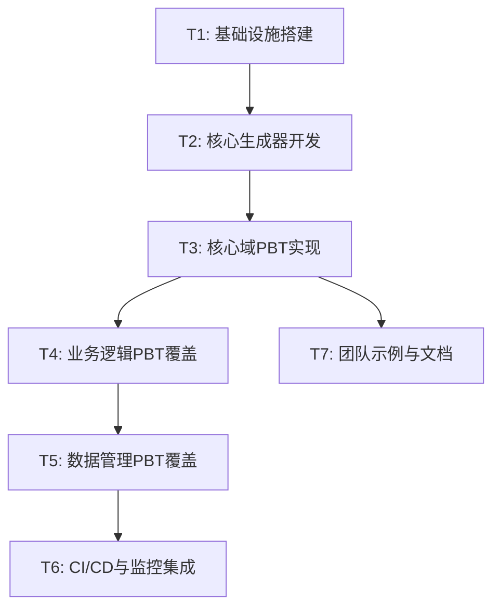

# TASK - 属性测试实施任务拆分

## 1. 实施任务概览

基于设计架构，我们将实施过程拆分为以下原子任务。

---

## 2. 任务详细定义

### T1: 基础设施搭建 (融合 ENG01)
- **目标**: 在 ENG01 基础设施基础上扩展 PBT 能力。
- **输入契约**: 现有的 `vitest.config.ts`, `ENG01` 规范。
- **输出契约**: 
  - `packages/shared/src/test/arbitraries/`: 通用生成器（Email, DateRange 等）。
  - `packages/server/src/common/test/arbitraries/`: 领域特定生成器。
  - `package.json`: 新增 `test:pbt` 脚本（复用 Vitest）。
- **融合点**: 
  - 复用 ENG01 定义的 Vitest 运行器。
  - 扩展 Shared 包的测试工具链。
- **验收标准**: 
  - `npm run test:pbt` 能正确识别 `*.pbt.test.ts`。
  - 能够引用 Shared 包中的 Arbitraries。

### T2: 核心生成器开发 (Arbitraries)
- **目标**: 构建领域特定的数据生成器库。
- **输入契约**: `packages/shared/src/types/index.ts` 中的模型定义。
- **输出契约**: 
  - `time-period.arb.ts`: 时间段生成器。
  - `attendance-shift.arb.ts`: 班次生成器。
  - `user-employee.arb.ts`: 用户与员工生成器。
- **验收标准**: 生成器能够产生符合业务约束（如 start < end）的随机数据，且无类型错误。

### T3: 核心域 PBT 实现 (Phase 1)
- **目标**: 覆盖最复杂的考勤计算逻辑。
- **输入契约**: `attendance/domain/attendance-calculator.ts`。
- **输出契约**: `attendance/domain/attendance-calculator.pbt.test.ts`。
- **验证属性**: 
  - **总时长守恒**: `总时长 = 工作时长 + 休息时长 + 旷工时长`。
  - **单调性**: 增加打卡记录不应减少已计算的工作时长。
- **验收标准**: 通过 1000 次随机迭代。

### T4: 业务逻辑 PBT 覆盖 (Phase 2)
- **目标**: 覆盖状态流转和业务规则。
- **输入**: `attendance-correction.service.ts`, `leave.service.ts`。
- **输出**: 对应的 `*.pbt.test.ts`。
- **验证属性**: 
  - **状态幂等性**: 重复审批不应改变最终状态。
  - **权限约束**: 随机生成的非权限用户尝试操作必须失败。
- **验收标准**: 核心 Service 方法全覆盖。

### T5: 数据管理 PBT 覆盖 (Phase 3)
- **目标**: 验证 CRUD 的完整性和约束。
- **输入**: `user.service.ts`, `employee.service.ts`。
- **输出**: 对应的 `*.pbt.test.ts`。
- **验证属性**: 
  - **往返属性**: `create -> get == input`。
  - **唯一性约束**: 随机生成的重复邮箱/工号必须导致冲突错误。
- **验收标准**: 基础 Service 逻辑全覆盖。

### T6: CI/CD 与监控集成
- **目标**: 将 PBT 固化到研发流程。
- **输出**: `.github/workflows/` 配置更新。
- **验收标准**: CI 失败时能正确报告失败的 Seed。

### T7: 团队示例与文档
- **目标**: 建立 PBT 编写范式，降低团队上手门槛。
- **输出**: `docs/属性测试/BEST_PRACTICES.md`。
- **验收标准**: 包含至少 3 个典型场景的 Property 编写模板。

---

## 3. 优先级与进度追踪

| 任务 ID | 名称 | 优先级 | 状态 | 负责人 |
| :--- | :--- | :--- | :--- | :--- |
| T1 | 基础设施搭建 | P0 | 待开始 | AI Agent |
| T2 | 核心生成器开发 | P0 | 待开始 | AI Agent |
| T3 | 核心域PBT实现 | P0 | 待开始 | AI Agent |
| T4 | 业务逻辑PBT覆盖 | P1 | 待开始 | AI Agent |
| T5 | 数据管理PBT覆盖 | P2 | 待开始 | AI Agent |
| T6 | CI/CD集成 | P1 | 待开始 | AI Agent |
| T7 | 团队示例与文档 | P2 | 待开始 | AI Agent |
