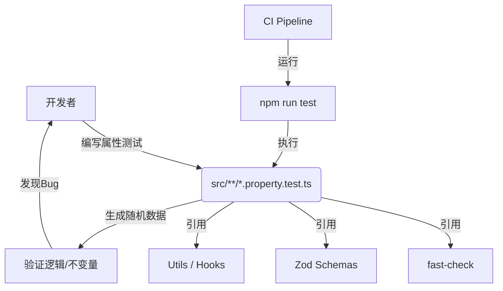

# DESIGN - 属性测试实施 (Web端)

## 1. 实施架构图



## 2. 技术分层设计

### L1: 基础设施层 (Infrastructure)
- **依赖**: 引入 `fast-check` 作为 devDependency。
- **运行器**: 使用现有的 `vitest` 作为 Test Runner。
- **配置**:
  - 无需修改 `vite.config.ts`。
  - 在 CI 环境下，可以通过环境变量 `FC_NUM_RUNS` 调整测试运行次数。

### L2: 测试策略层 (Strategy)
鉴于 Web 端业务特点，采用以下策略：

1.  **Schema 健壮性测试 (Schema Fuzzing)**
    - **目标**: `src/schemas/*.ts`
    - **方法**: 使用 `fast-check` 生成各种边界数据（负数、超长字符串、特殊字符、非法日期），验证 Zod Schema 的 `safeParse` 行为是否符合业务预期。
    - **价值**: 发现 Schema 定义过宽（如未限制工时为正数）或过严的问题。

2.  **纯函数逻辑测试 (Logic Verification)**
    - **目标**: `src/utils/*.ts` (未来扩展的复杂逻辑)
    - **方法**: 针对数据转换、格式化函数，验证其“往返性”或“幂等性”。

3.  **状态逻辑测试 (State Machine)**
    - **目标**: 复杂 `hooks` (如分页逻辑、表单状态管理)
    - **方法**: 模拟一系列随机操作序列（点击下一页、改变筛选条件），验证状态的一致性。

### L3: 实施细节层 (Implementation)

#### 目录结构
推荐将属性测试文件与源文件放置在一起，命名为 `*.property.test.ts` 以示区分。

```
packages/web/src/
├── schemas/
│   ├── attendance.ts
│   └── __tests__/
│       └── attendance.property.test.ts  <-- 新增
└── utils/
    ├── date-helper.ts
    └── date-helper.property.test.ts     <-- 新增
```

#### 示例代码模式

**场景：验证考勤规则 Schema 的合理性**

```typescript
import { fc } from '@fast-check/vitest';
import { describe, test, expect } from 'vitest';
import { TimePeriodRulesSchema } from '../attendance';

describe('TimePeriodRulesSchema Property Tests', () => {
  test.prop({
    minWorkHours: fc.float({ min: -10, max: 24 }),
    maxWorkHours: fc.float({ min: -10, max: 24 })
  })('should reject negative work hours', ({ minWorkHours, maxWorkHours }) => {
    const result = TimePeriodRulesSchema.safeParse({
      minWorkHours,
      maxWorkHours
    });
    
    if (minWorkHours < 0 || maxWorkHours < 0) {
      expect(result.success).toBe(false); // 期望 Schema 拦截负数
    }
  });
});
```

## 3. 培训体系
- **文档**: 在 `docs/属性测试实施/BEST_PRACTICES.md` 中提供常见模式。
- **演示**: 在 Pilot 阶段录制一次简单的编写过程。

## 4. 质量保证
- **CI 集成**: 属性测试必须在 PR Check 中通过。
- **超时控制**: 单个属性测试执行时间不超过 2秒（通过限制 runs 数量）。
