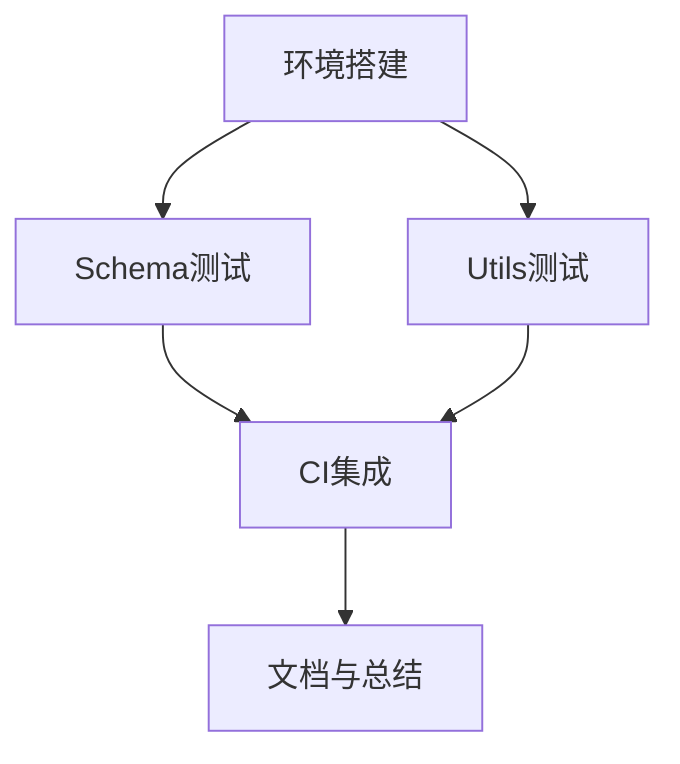

# TASK - 属性测试实施 (Web端)

## 任务依赖图

## 任务列表

### T1: 环境搭建 (Environment Setup)
- **输入**: `packages/web` 现有环境
- **输出**: `package.json` 包含 `fast-check`，Vitest 配置确认
- **步骤**:
  1. 安装 `fast-check` 作为 devDependency.
  2. 验证 `npm run test` 是否正常运行.

### T2: Schema 属性测试 (Schema Property Tests)
- **输入**: `src/schemas/attendance.ts`
- **输出**: `src/schemas/__tests__/attendance.property.test.ts`
- **验收标准**:
  - 针对 `TimePeriodRulesSchema` 编写属性测试.
  - 验证数值边界 (如负数、极大值).
  - 验证字段组合 (如 StartOffset > EndOffset 的情况).

### T3: Utils 属性测试 (Utils Property Tests)
- **输入**: `src/utils/auth.ts`
- **输出**: `src/utils/auth.property.test.ts`
- **验收标准**:
  - 验证 `getToken/setToken` 的往返一致性 (Round-trip property).
  - 验证 `getUser/setUser` 的 JSON 序列化/反序列化稳定性.

### T4: CI 集成 (CI Integration)
- **输入**: 本地测试通过
- **输出**: 确认 CI 命令有效
- **步骤**:
  1. 运行 `npm run test` 确保包含新测试.
  2. 模拟 CI 环境运行 (如设置环境变量).

### T5: 文档与总结 (Documentation)
- **输入**: 执行结果
- **输出**: `BEST_PRACTICES.md`, `FINAL_属性测试实施.md`
- **步骤**:
  1. 记录最佳实践示例.
  2. 总结本次实施成果.
