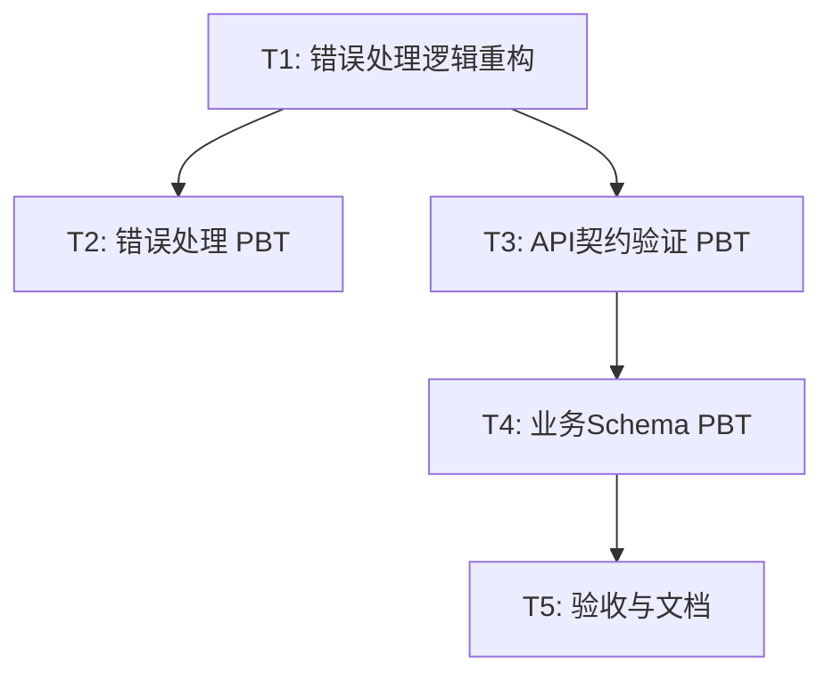

# TASK - 属性测试实施任务清单 (Phase 2: App Focus)

## 1. 任务依赖图

## 2. 任务详细定义

### T1: 错误处理逻辑重构 (Refactor)
- **目标**: 将 `packages/app/src/utils/request.ts` 中的副作用逻辑（Alert, Navigation）剥离。
- **输入**: `packages/app/src/utils/request.ts`
- **输出**: 
  - `packages/app/src/utils/error-handler.ts`: 包含纯函数 `analyzeErrorResponse(status, data)`。
  - 更新后的 `request.ts`：调用上述纯函数，然后执行副作用。
- **验收标准**: `npm run lint` 通过，原有功能不受影响。

### T2: 错误处理 PBT (Utils)
- **目标**: 验证错误分析逻辑的正确性。
- **输入**: `packages/app/src/utils/error-handler.ts`
- **输出**: `packages/app/src/utils/__tests__/error-handler.prop.test.ts`
- **属性**:
  - 401 状态码必须返回 `CLEAR_AUTH` 动作。
  - 403 状态码必须返回 `PERMISSION_DENIED` 动作。
  - 未知状态码必须返回通用错误信息。

### T3: API 契约验证 PBT (Request)
- **目标**: 验证 `validateResponse` 函数的健壮性。
- **输入**: `packages/app/src/utils/request.ts`
- **输出**: `packages/app/src/utils/__tests__/request.prop.test.ts`
- **属性**:
  - `validateResponse(validData, schema)` === `validData`
  - `validateResponse(invalidData, schema)` throws `ValidationError`
  - `validateResponse(errorResponse, schema)` throws `ApiError`

### T4: 业务 Schema PBT (Schemas)
- **目标**: 验证考勤核心数据的 Schema 定义。
- **输入**: `packages/app/src/schemas/attendance.ts`
- **输出**: `packages/app/src/schemas/__tests__/attendance.prop.test.ts`
- **范围**:
  - `ClockRecordSchema`
  - `LeaveVoSchema`
  - `ScheduleVoSchema`
- **属性**:
  - 生成的随机数据必须能通过 `safeParse`。
  - 验证 Schema 中的 `refine` 规则（如结束时间 > 开始时间）。

### T5: 验收与文档
- **目标**: 运行所有测试并记录结果。
- **输出**: 更新 `ACCEPTANCE_属性测试实施.md`。
