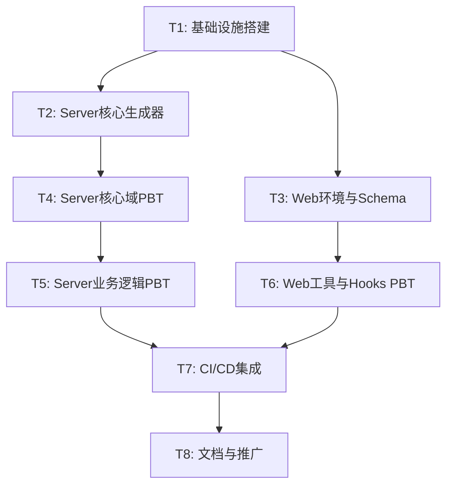

# TASK - 属性测试实施任务拆分 (Integrated)

## 1. 任务概览

本计划整合了 Server 端的核心逻辑验证需求与 Web 端的数据健壮性验证需求。

## 2. 任务详细定义

### T1: 基础设施搭建 (Infrastructure)
- **目标**: 在 Monorepo 层面配置 PBT 环境。
- **范围**: `packages/shared`, `packages/server`, `packages/web`
- **输出**:
  - `package.json`: 确认 `fast-check` 依赖 (Dev)。
  - `packages/shared/src/test/arbitraries/`: 建立公共生成器目录。
  - `npm script`: 添加 `test:pbt` 命令。

### T2: Server 核心生成器 (Core Generators)
- **目标**: 构建 Server 端核心领域对象的生成器。
- **输入**: `packages/shared/src/types`
- **输出**:
  - `time-period.arb.ts`: 时间段生成器。
  - `attendance-record.arb.ts`: 打卡记录生成器。
  - `shift.arb.ts`: 班次生成器。
- **验收标准**: 生成器能稳定产生符合基础约束的数据。

### T3: Web 环境与 Schema 测试 (Web Foundation)
- **目标**: Web 端引入 PBT 并覆盖 Schema。
- **输入**: `packages/web/src/schemas`
- **输出**:
  - `packages/web/src/schemas/__tests__/*.property.test.ts`
- **验收标准**: 针对核心 Zod Schema 完成 Fuzzing 测试，验证边界稳定性。

### T4: Server 核心域 PBT (Core Domain)
- **目标**: 覆盖考勤计算核心算法。
- **输入**: `attendance/domain/attendance-calculator.ts`
- **输出**: `attendance-calculator.pbt.test.ts`
- **验收标准**: 验证“总时长守恒”、“单调性”等关键属性，通过 1000 次迭代。

### T5: Server 业务逻辑 PBT (Business Logic)
- **目标**: 覆盖补卡、请假等状态流转。
- **输入**: `correction.service.ts`, `leave.service.ts`
- **输出**: 对应的 PBT 测试。
- **验收标准**: 验证状态机转换的合法性和幂等性。

### T6: Web 工具与 Hooks PBT (Web Logic)
- **目标**: 覆盖前端复杂逻辑。
- **输入**: `src/utils`, 复杂 `hooks`
- **输出**: `*.property.test.ts`
- **验收标准**: 覆盖日期处理、数据转换等纯函数。

### T7: CI/CD 集成 (Integration)
- **目标**: 将 PBT 纳入自动化流程。
- **输出**: GitHub Actions / CI 脚本更新。
- **验收标准**: CI 环境可配置运行次数，失败时报告 Seed。

### T8: 文档与推广 (Documentation)
- **目标**: 沉淀经验，赋能团队。
- **输出**: `BEST_PRACTICES.md`, 示例代码库。
- **验收标准**: 完成一篇最佳实践文档，包含 Server/Web 典型案例。

## 3. 进度追踪

| ID | 任务名称 | 端 | 优先级 | 状态 |
|:---|:---|:---|:---|:---|
| T1 | 基础设施搭建 | All | P0 | ✅ 已完成 |
| T2 | Server核心生成器 | Server | P0 | ✅ 已完成 |
| T3 | Web环境与Schema | Web | P1 | ✅ 已完成 |
| T4 | Server核心域PBT | Server | P0 | ✅ 已完成 |
| T5 | Server业务逻辑PBT | Server | P1 | ✅ 已完成 |
| T6 | Web工具与Hooks | Web | P2 | ✅ 已完成 |
| T7 | CI/CD集成 | All | P1 | ✅ 已完成 |
| T8 | 文档与推广 | All | P2 | ✅ 已完成 |
